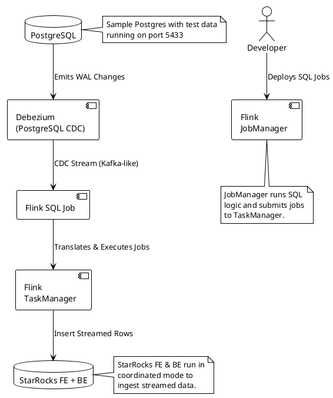

# Flink PostgreSQL to StarRocks Real-Time Pipeline

This project sets up a **real-time CDC (Change Data Capture)** data pipeline using **Flink**, **Debezium**, and **StarRocks**. It reads data from PostgreSQL and streams it to StarRocks using Flink SQL jobs and Docker orchestration.

---

## 📦 Architecture Overview (PlantUML)

> To render this diagram on GitHub, use a plugin like [PlantUML for Markdown](https://github.com/plantuml/plantuml-markdown) or a compatible renderer (e.g., [Kroki.io](https://kroki.io/)).



---

## 🔧 What’s Included

| Component      | Description |
|----------------|-------------|
| `docker-compose.yml` | Spins up PostgreSQL, Debezium, StarRocks, Flink JobManager & TaskManager |
| `setup_pipeline.sh`  | Automates cleanup, JAR download, build, and job submit |
| `Dockerfile.jobmanager` & `Dockerfile.taskmanager` | Adds required connectors into Flink |
| `flink_libs/`   | Auto-downloaded connector JARs (Postgres CDC, StarRocks Sink) |
| `sql/*.sql`     | SQL scripts to create Flink source, sink, and CDC streaming jobs |

---

## 🚀 Quick Start

```bash
# Clone the repo
git clone https://your.repo/flink-postgres-to-storrocks.git
cd flink-postgres-to-storrocks

# Start the full pipeline (Postgres → Flink → StarRocks)
sudo bash setup_pipeline.sh
```

Once Flink JobManager is ready, it auto-runs:

1. `create_source_postgres.sql`
2. `create_sink_starrocks.sql`
3. `cdc_job.sql`

All changes from PostgreSQL are streamed live into StarRocks.

---

## 📁 Project Layout

```
flink-postgres-to-storrocks/
├── docker-compose.yml
├── setup_pipeline.sh
├── Dockerfile.jobmanager
├── Dockerfile.taskmanager
├── flink_libs/
│   ├── flink-sql-connector-postgres-cdc-2.3.0.jar
│   ├── flink-connector-starrocks-1.2.6_flink-1.15.jar
│   └── flink-dist_2.12-1.16.2-csadh1.10.0.100.jar
├── sql/
│   ├── create_source_postgres.sql
│   ├── create_sink_starrocks.sql
│   └── cdc_job.sql
└── README.md
```

---

## 🧠 Tips

- PostgreSQL CDC via Debezium requires **logical replication** and a **replication slot**.
- Make sure PostgreSQL and StarRocks containers have stable data directories if you want to persist data (optional in this project).
- If you're behind a corporate proxy, export your `http_proxy`/`https_proxy` vars before running.

---

## ✅ Final Output

After the pipeline starts:
- PostgreSQL emits changes (inserts, updates, deletes)
- Flink reads the changes via Debezium
- Transforms and inserts into StarRocks via stream sink

---

For any issues, check container logs:
```bash
docker compose logs jobmanager
docker compose logs taskmanager
```