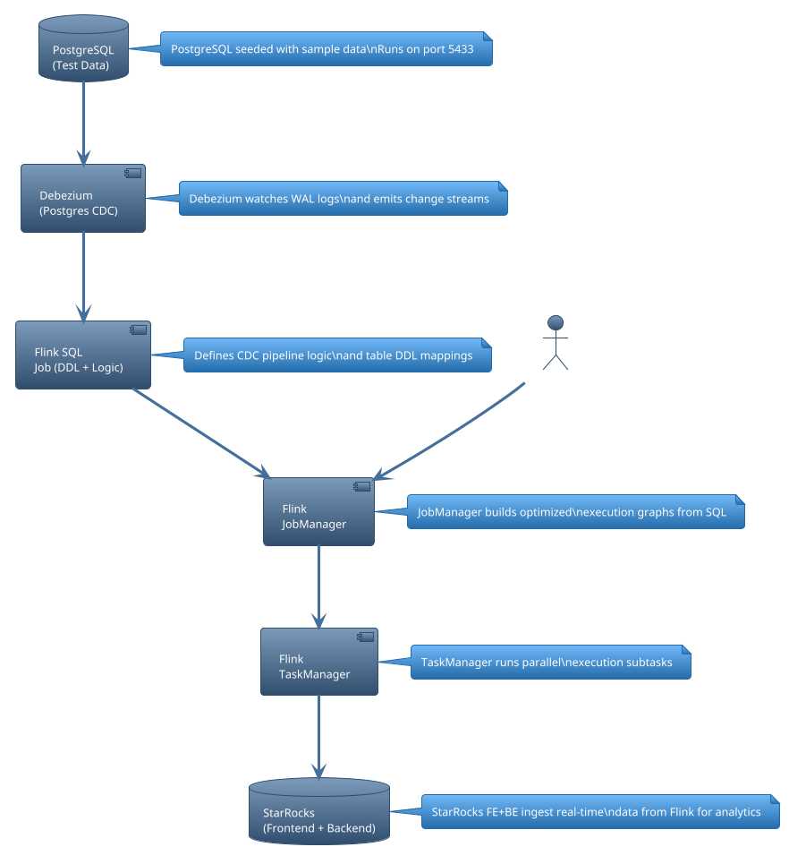

# 🚀 Flink PostgreSQL to StarRocks CDC Pipeline

This project demonstrates a complete Flink CDC pipeline using:
- 📦 **Debezium** for PostgreSQL Change Data Capture
- 🔄 **Apache Flink** to process and transform changes in real-time
- 📊 **StarRocks** as the analytical sink

## 🧱 Architecture Overview

To render the diagram below, use [Kroki.io](https://kroki.io) or a Markdown PlantUML renderer.


<details>
<summary>📜 PlantUML Source</summary>



</details>

## 🛠 Components

| Component     | Description                                   |
|---------------|-----------------------------------------------|
| PostgreSQL    | Source DB generating WAL logs for Debezium    |
| Debezium      | Captures WAL logs and produces CDC events     |
| Flink SQL     | Defines pipeline transformations (Flink DDL)  |
| JobManager    | Translates jobs into physical pipelines       |
| TaskManager   | Executes jobs and pushes to StarRocks         |
| StarRocks     | Real-time analytical store                     |

## 🧪 Local Development

```bash
./setup_pipeline.sh
```

> This will:
> - Stop & clean existing containers
> - Download required JARs (Debezium + StarRocks + Runtime)
> - Start PostgreSQL, Flink, and StarRocks containers
> - Deploy SQL CDC pipeline